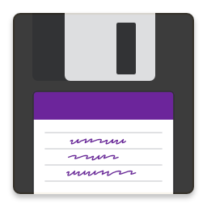
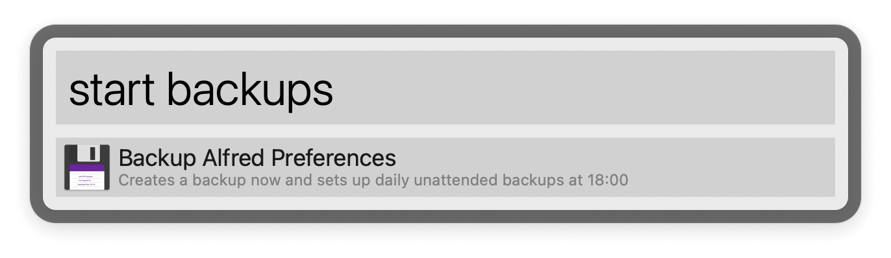
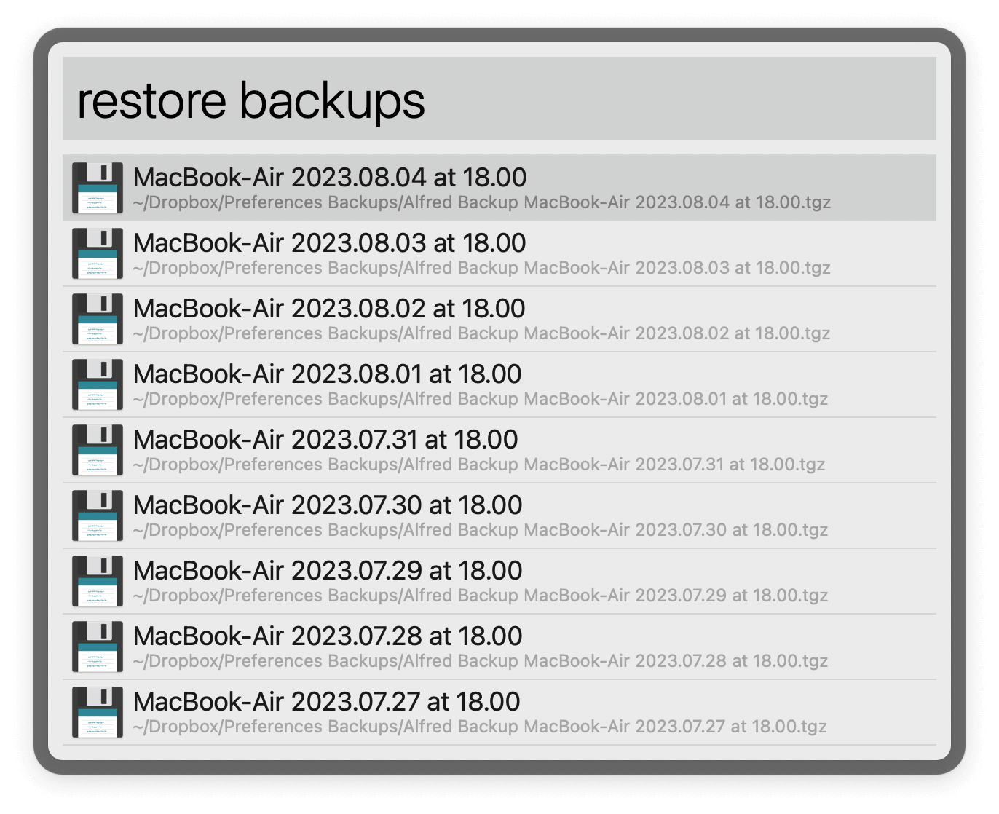

#  Backup Preferences Alfred Workflow

Create and restore Alfred Preferences backups

[⤓ Install on the Alfred Gallery](https://alfred.app/workflows/alfredapp/backup-preferences)

## Usage

Generate a backup of your local Alfred Preferences via the `start backup` keyword. A macOS launchd agent will be loaded to do it daily at the time set in the [Workflow’s Configuration](https://www.alfredapp.com/help/workflows/user-configuration/) (using the [24-hour clock format](https://en.wikipedia.org/wiki/24-hour_clock)). The number of versions to keep is likewise configurable.

Restore a previous version with the `restore backup` keyword. It takes a few seconds to complete and restarts Alfred.

